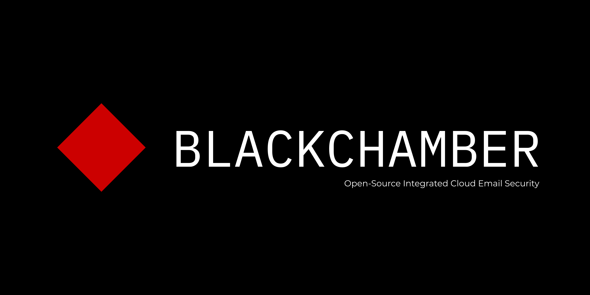
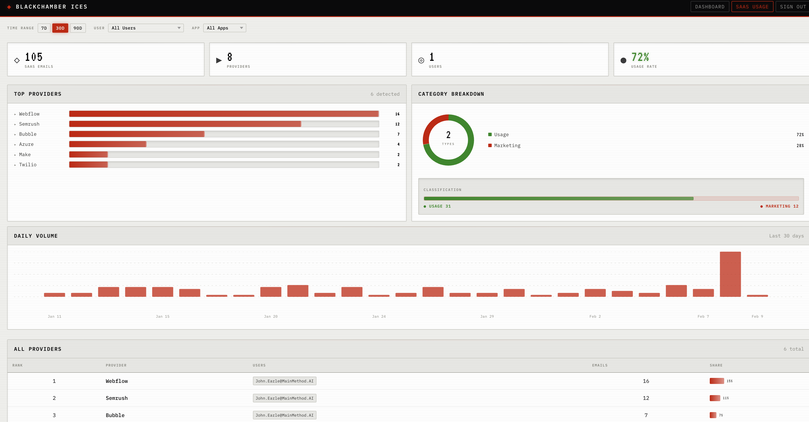

<p align="center">
  
</p>

**Integrated Cloud Email Security** — an open-source email security platform that connects to Microsoft 365 mailboxes, analyzes incoming messages in real time, and enforces configurable security policies.

<p align="center">
  
</p>

## Architecture

```
┌─────────────────────────────────────────────────────────────────────┐
│                       Microsoft 365 (Graph API)                     │
└───────────┬────────────────────────────────────┬────────────────────┘
            │ Webhooks + Delta Sync              │ Quarantine / Delete
            ▼                                    ▲
┌───────────────────┐                  ┌─────────────────────┐
│   Ingestion (Go)  │───── Redis ─────▶│  Analysis Workers   │
│   • Webhooks      │    (Celery Q)    │  (Python × N)       │
│   • Delta sync    │                  │  • Header auth      │
│   • User discover │                  │  • URL reputation    │
│   • Backfill CLI  │                  │  • Attachment check  │
└───────────────────┘                  │  • Spamhaus lookup   │
                                       │  • SaaS usage (NLP)  │
                                       └─────────┬───────────┘
                                                  │ Redis (Celery Q)
                                                  ▼
                                       ┌─────────────────────┐
                                       │  Verdict Workers     │
                                       │  (Python × N)        │
                                       │  • Policy engine     │
                                       │  • Batch dispatcher  │
                                       │  • Graph API actions │
                                       └─────────┬───────────┘
                                                  │
                                                  ▼
                                       ┌─────────────────────┐
                                       │  PostgreSQL          │
                                       │  • Email events      │
                                       │  • Analysis results  │
                                       │  • Policy outcomes   │
                                       └─────────┬───────────┘
                                                  │
                                                  ▼
                                       ┌─────────────────────┐
                                       │  WebUI               │
                                       │  (React + FastAPI)   │
                                       │  • Message dashboard │
                                       │  • Trip detail view  │
                                       │  • JWT auth          │
                                       └─────────────────────┘
```

## Services

| Service | Language | Description |
|---------|----------|-------------|
| **ingestion** | Go | Connects to M365 via Graph API. Receives webhook notifications and runs delta sync to catch gaps. Auto-discovers mailbox users per tenant. |
| **analysis-worker** | Python | Celery workers that run a pipeline of modular analyzers against each email. |
| **verdict-worker** | Python | Evaluates YAML policies against analysis results, dispatches actions (quarantine, delete, tag) back to M365 via Graph API. |
| **verdict-beat** | Python | Celery Beat scheduler for periodic batch flush of verdict actions. |
| **webui** | Python/React | FastAPI backend + React SPA dashboard. JWT-authenticated. Displays message trips, analysis results, and policy outcomes. |
| **postgres** | — | System of record for email events, analysis results, and policy outcomes. |
| **redis** | — | Celery broker + inter-service message queue + dedup cache. |

## Analyzers

| Analyzer | Key Observations | Description |
|----------|-----------------|-------------|
| `header_auth` | `spf`, `dkim`, `dmarc`, `arc` | Validates email authentication headers (SPF/DKIM/DMARC/ARC pass/fail) |
| `url_check` | `ip_urls_found`, `shortened_urls` | Checks for suspicious URLs (raw IP addresses, URL shortener abuse) |
| `attachment_check` | `dangerous_extensions`, `has_attachments` | Flags dangerous file extensions (.exe, .scr, .bat, etc.) |
| `spamhaus` | `listed`, `spamhaus_zone` | Checks sender IP against Spamhaus blocklists |
| `saas_usage` | `is_saas`, `provider`, `category`, `confidence` | Identifies SaaS vendor emails via known-vendor lookup + NLP classification |

## Policy Engine

Policies are defined in `config/config.yaml` and evaluated by the verdict workers against analysis observations:

```yaml
policies:
  - name: quarantine-dmarc-failure
    tenant: "*"
    sender: "*"
    when:
      analyzer: header_auth
      observation: dmarc
      equals: "fail"
    action: quarantine

  - name: tag-suspicious-urls
    tenant: "*"
    when:
      analyzer: url_check
      observation: ip_urls_found
      gte: 1
    action: tag
```

**Match types:** `equals`, `gte`, `lte`, `contains`, `exists`
**Actions:** `delete` > `quarantine` > `tag` > `none` (highest priority wins)
**Scoping:** Filter by `tenant`, `sender` (supports wildcards), and `recipients`

## Quick Start

### Prerequisites

- Docker & Docker Compose
- Microsoft 365 tenant with an [Azure App Registration](https://learn.microsoft.com/en-us/entra/identity-platform/quickstart-register-app) granting `Mail.Read` and `Mail.ReadWrite` application permissions

### 1. Configure

```bash
cp .env.example .env
```

Edit `.env` with your M365 credentials:

```env
M365_TENANT_ID=your-tenant-id
M365_CLIENT_ID=your-client-id
M365_CLIENT_SECRET=your-client-secret
```

Edit `config/config.yaml` to configure tenants, users, and policies.

### 2. Start

```bash
# Production mode
docker compose up -d

# Development mode (includes ngrok for webhook tunneling)
docker compose --profile dev up -d
```

### 3. Access the Dashboard

Open [http://localhost:8090](http://localhost:8090) and log in with the admin credentials from `.env` (default: `admin` / `changeme`).

### 4. Backfill Historical Emails (Optional)

Seed the database with existing emails on a new deployment:

```bash
# Last 7 days, all users
docker compose run --rm --entrypoint /backfill ingestion --tenant <alias> --since 168h

# Last 30 days, specific users
docker compose run --rm --entrypoint /backfill ingestion \
  --tenant <alias> \
  --users "user1@org.com,user2@org.com" \
  --since 720h
```

## Multi-Tenant Configuration

ICES supports multiple M365 tenants. Each tenant gets its own OAuth2 credentials and user discovery:

```yaml
tenants:
  - alias: "acme-corp"
    provider: "m365"
    tenant_id: "${M365_TENANT_ID_1}"
    client_id: "${M365_CLIENT_ID_1}"
    client_secret: "${M365_CLIENT_SECRET_1}"
    include_users: []          # empty = auto-discover all licensed users
    exclude_users:
      - "noreply@acme-corp.com"

  - alias: "globex"
    provider: "m365"
    tenant_id: "${M365_TENANT_ID_2}"
    client_id: "${M365_CLIENT_ID_2}"
    client_secret: "${M365_CLIENT_SECRET_2}"
    include_users:
      - "ceo@globex.com"
      - "cfo@globex.com"
```

## Project Structure

```
BlackChamber-ICES/
├── ingestion/          # Go — M365 Graph API integration
│   ├── cmd/server/     #   Main ingestion service
│   ├── cmd/backfill/   #   Historical email backfill CLI
│   └── internal/       #   Core packages (delta, graph, webhook, etc.)
├── analysis/           # Python — Email analysis pipeline
│   └── src/analysis/
│       ├── analyzers/  #   Modular analyzer plugins
│       ├── pipeline.py #   Analyzer orchestration
│       └── tasks.py    #   Celery task definitions
├── verdict/            # Python — Policy evaluation + actions
│   └── src/verdict/
│       ├── actions/    #   quarantine, delete, tag
│       ├── policy_engine.py
│       └── dispatcher.py
├── webui/              # Python/React — Dashboard
│   ├── src/webui/      #   FastAPI backend
│   └── frontend/       #   React SPA
├── shared/             # Shared Python library + schemas
├── config/             # config.yaml
├── scripts/            # Utility scripts
└── docker-compose.yml
```

## Testing

```bash
# Ingestion (Go)
cd ingestion && docker build --target test .

# Analysis (Python)
docker compose run --rm --build analysis-worker python -m pytest tests/ -v

# All services
docker compose -f docker-compose.test.yml up --build
```

## License

Apache License 2.0 — see [LICENSE](LICENSE) for details.

Copyright 2026 John Earle
